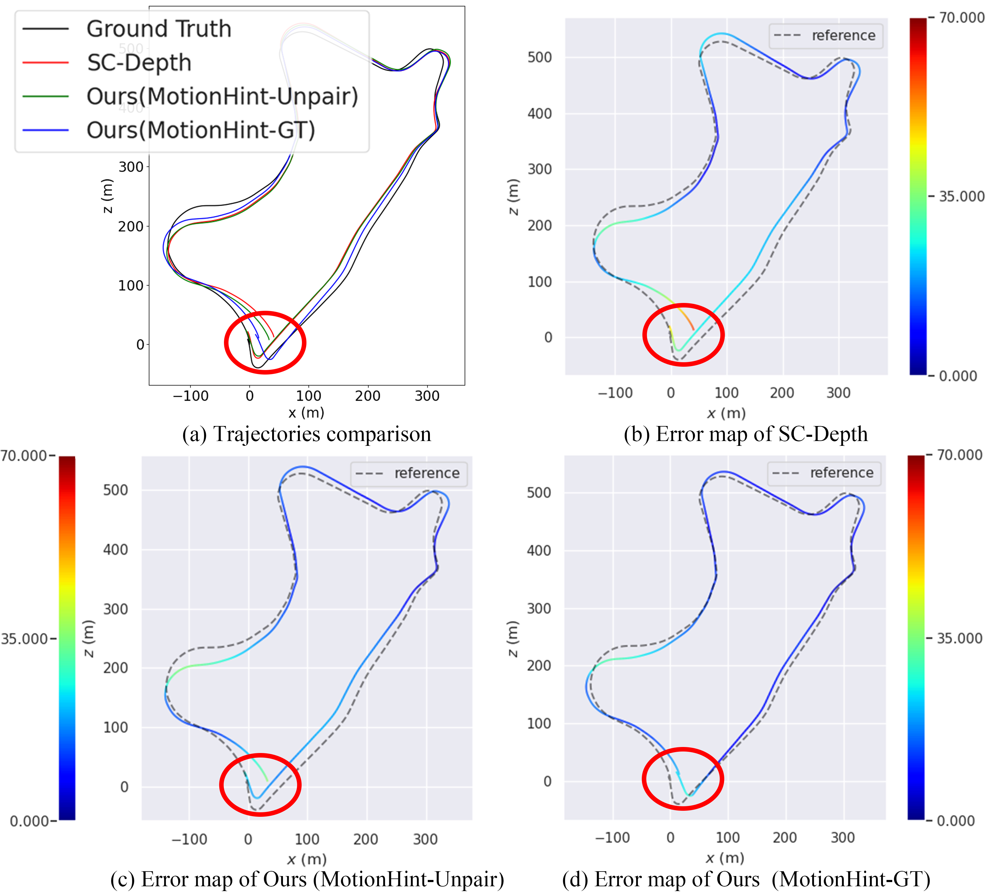

# MotionHint: Self-Supervised Monocular Visual Odometry with Motion Constraints

This is the official PyTorch implementation of "MotionHint: Self-Supervised Monocular Visual Odometry with Motion Constraints".

> **MotionHint: Self-Supervised Monocular Visual Odometry with Motion Constraints**
>
> [Cong Wang](https://scholar.google.com/citations?user=0gSn6sgAAAAJ&hl=en), [Yu-Ping Wang](https://scholar.google.com/citations?user=S41MwX0AAAAJ&hl=en) and [Dinesh Manocha](https://scholar.google.com/citations?user=X08l_4IAAAAJ&hl=en)
>
> [ICRA 2022 (arXiv pdf)](https://arxiv.org/abs/2109.06768)

<p align="center">
  
</p>

This code is for non-commercial use; please see the [license file](LICENSE) for terms.

If you find our work useful in your research please consider citing our paper:

```
@article{motionhint,
  author    = {Cong Wang and
               Yu{-}Ping Wang and
               Dinesh Manocha},
  title     = {MotionHint: Self-Supervised Monocular Visual Odometry with Motion
               Constraints},
  journal   = {CoRR},
  volume    = {abs/2109.06768},
  year      = {2021}
}
```

## ⚙️ Setup

First, assuming you are using a fresh [Anaconda](https://www.anaconda.com/download/) distribution, you can set up the environment with:
```shell
conda env create -f environment.yaml
```

This command will install all packages used during training and testing.

## Dataset

You can download the KITTI Odometry dataset from [here](http://www.cvlibs.net/datasets/kitti/eval_odometry.php).
You need to download the color odometry dataset (~65GB) and the ground truth poses (~4MB), and organize them as:

```
data_path
│
└───poses
│   │   00.txt
│   │   01.txt
|   |   ...
|   |   21.txt
│   
└───sequences
    │   
    └───00
    |   |   calib.txt
    |   |   times.txt
    |   └───image_2
    |   |   |   000000.png
    |   |   |   000001.png
    |   |   |   ...
    |   |      
    |   └───image_3
    |       |   000000.png
    |       |   000001.png
    |       |   ...
    |   
    └───01
    |   |   calib.txt
    |   |   times.txt
    |   └───image_2
    |   |   |   000000.png
    |   |   |   000001.png
    |   |   |   ...
    |   |      
    |   └───image_3
    |       |   000000.png
    |       |   000001.png
    |       |   ...
    |
    └───02
    |
    ...
```

## Training

To train our MotionHint models, you need to first download the pretrained model of [Monodepth2](https://drive.google.com/drive/folders/1TwdYB8B3sB9NyWR9Q4eNVtOnQ1B4Fxu9?usp=sharing), and replace 'PRETRAINED_MONODEPTH2' in all training scripts with your own path.

Using the shell scripts in ```./scripts```, you can train the self-supervised visual odometry with our MotionHint.

There are totally three setups in our paper,

**If you want to train the network using *'Ground Truth'* setup**, you should run:
```shell
./scripts/train_gt_setup.sh 0     # 0 infers using the gpu 0.
```

**If you want to train the network using *'Paired Poses'* setup**, you should run:
```shell
./scripts/train_pair_setup.sh 0     # 0 infers using the gpu 0.
```

**If you want to train the network using *'Unpaired Poses'* setup**, you should run:
```shell
./scripts/train_unpair_setup.sh 0     # 0 infers using the gpu 0.
```

Before running all scripts, you need to change the values of 'DATA_PATH' and 'LOG_PATH' in the scripts. The models will be saved in ```LOG_PATH/models```, and the latest model will be used for evaluation.

You can also change some parameters in scripts and ```options.py``` to do some ablation study.

## Evaluation

We directly employ [the KITTI Odometry Evaluation Toolbox](https://github.com/Huangying-Zhan/kitti-odom-eval) to evaluate our models. For convenience, we have integrated the toolbox into our code, and written a script to do the evaluation.

**If you want to evlaute a MotionHint model**, you can run:
```shell
./scripts/eval_model.sh YOUR_MODEL_PATH EVALUATION_NAME
```
The evaluation results will be shown in the terminal, and saved in ```./evaluations/result/EVALUATION_NAME```.

## Results and Pre-trained Models

| Model name        | Seq 09 translation error(%) | Seq 09 rotation error(°/100m) | Seq 09 ATE(m) | Seq 10 translation error(%) | Seq 10 rotation error(°/100m) | Seq 10 ATE(m) | 
|------------------------|-------------------|--------------------------|-----------------|------|----------------|----|
| [`MonoDepth2`](https://drive.google.com/drive/folders/1TwdYB8B3sB9NyWR9Q4eNVtOnQ1B4Fxu9?usp=sharing)| 15.079 | 3.335 | 69.019 | 12.102 | 4.927 | 19.371 |
| [`MotionHint(Ground Truth)`](https://drive.google.com/drive/folders/1ubB-6U65VpAS3dAEUxgbdY1HFb3okvf7?usp=sharing) | 13.502 | 2.998 | 62.337 | 10.377 | 4.453 | 17.541 |
| [`MotionHint(Paired Pose)`](https://drive.google.com/drive/folders/15l1uqj_ooVYpoeh7p7NdCz92-ZdfijgC?usp=sharing) | 14.071 | 3.099 | 64.704 | 10.976 | 4.495 | 17.752 |
| [`MotionHint(Unpaired Pose)`](https://drive.google.com/drive/folders/19j6cJCxF9lIp-lFO3c0sk9IQwuxlGrZM?usp=sharing) | **9.761** | **2.226** | **46.036** | **8.679** | **3.334** | **13.282** |

All models above are trained for 20 epochs, and then **the lastest version** is taken as the final model.
